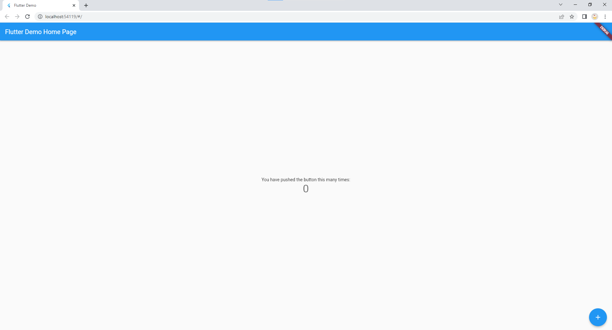
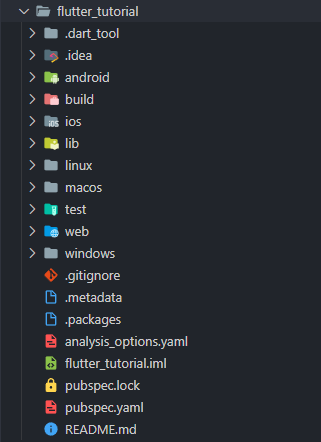

# Tutorial Flutter

## Index

- [Requisitos](#requisitos)
- [Objetivo](#objetivo)
- [O que é Flutter?](#o-que-é-flutter)
- [Hands On](#hands-on)
  - [Iniciando um projeto](#iniciando-um-projeto)
  - [Executando o projeto](#executando-o-projeto)
  - [Tela inicial](#tela-inicial)
- [Entendendo o código](#entendendo-o-código)
  - [Nomenclaturas importantes](#nomenclaturas-importantes)
  - [Estrutura](#estrutura)
  - [pubspec.yaml](#pubspecyaml)
  - [Pasta lib](#pasta-lib)
  - [Main](#main)
    - [main.dart](#maindart)
    - [my_app.dart](#myappdart)
    - [my_home_page.dart](#myhomepagedart)

## Requisitos

- [Flutter](https://docs.flutter.dev/get-started/install)
- [Android Studio](https://developer.android.com/studio)
- [Visual Studio](https://visualstudio.microsoft.com/pt-br/downloads/) Caso queira executar o projeto no windows

## Objetivo

O objetivo deste tutorial é mostrar um pouco de como é estruturado um código em Flutter e entender como podemos desenvolver aplicações para diferentes dispositivos utilizando uma mesma base de código.

## O que é Flutter?

Flutter é um kit de desenvolvimento de interface de usuário, de código aberto, criado pela empresa Google em 2015, baseado na linguagem de programação Dart, que possibilita a criação de aplicativos compilados nativamente, para os sistemas operacionais Android, iOS, Windows, Mac, Linux, Fuchsia e Web.

Os aplicativos Flutter são escritos na linguagem de programação Dart e fazem uso de muitos dos recursos mais avançados da linguagem.

No Windows, macOS e Linux, por meio do projeto semi-oficial Flutter Desktop Embedding, o Flutter é executado na máquina virtual Dart, que possui um mecanismo de compilação que ocorre em tempo de execução. Ao escrever e depurar um aplicativo, o Flutter usa a compilação *just-in-time* (JIT), permitindo o chamado "hot reload", com a qual as modificações nos arquivos de origem podem ser injetadas em um aplicativo em execução. O Flutter estende isso com suporte para hot reload de widgets stateful, onde na maioria dos casos as alterações no código-fonte podem ser refletidas imediatamente no aplicativo em execução, sem a necessidade de uma reinicialização ou perda de estado.

As versões de lançamento dos aplicativos Flutter são compiladas *ahead-of-time* (AOT) no Android e no iOS, possibilitando o alto desempenho do Flutter em dispositivos móveis.

As principais vantagens do framework é:

- Alta produtividade, por ser uma ferramenta multiplataforma;
- Alta performance;
- Desenvolvimento rápido;
- Simplicidade;
- Compatibilidade.

## Hands on

### Iniciando um projeto

Para iniciar o nosso tutorial prático, iniciaremos um projeto do zero.

Podemos utilizar a ferramenta CLI do Flutter para a criação do projeto, nomearemos ele como flutter_tutorial.

```bash
flutter create flutter_tutorial
```

### Executando o projeto

Como estamos trabalhando com uma linguagem multiplataforma podemos executar nosso projeto em diversos dispositivos, conseguimos obter uma listagem deles através do comando:

```bash
$ flutter devices
3 connected devices:

Windows (desktop) • windows • windows-x64    • Microsoft Windows [versÆo 10.0.19044.1706]
Chrome (web)      • chrome  • web-javascript • Google Chrome 97.0.4692.99
Edge (web)        • edge    • web-javascript • Microsoft Edge 102.0.1245.33
```

Para maior facilidade, iremos executar nosso projeto na web, utilizando o Chrome. Dessa forma para executar o projeto basta rodar

```bash
flutter run -d chrome
```

### Tela inicial

Se tudo estiver corretamente configurado o comando deve abrir o Chrome com a seguinte tela:



## Entendendo o código

Nesta seção irei explicar a responsabilidade de cada componente de nossa aplicação

### Nomenclaturas importantes

- Widget: Qualquer componente de UI.
- StatelessWidget: Um Widget que não possui controle de estado interno (ex: text).
- StatefulWidget: Um widget que possui controle de estado interno (ex: checkbox).

### Estrutura

Nosso projeto é dividido em diversas pastas, possuimos pasta específicas para cada arquitetura onde dentro delas existem configurações exclusivas que possam ser modificadas quando necessário. Um exemplo, seria o `AndroidManifest.xml` na pasta android.



### pubspec.yaml

Um arquivo de grande importância é o `pubspec.yaml`, nele podemos configurar o nome de aplicação, a versão de release, configurar quais dependências queremos importar no projeto, importar os assets, etc.

```yaml
name: flutter_tutorial
description: A new Flutter project.

publish_to: 'none'

version: 1.0.0+1

environment:
  sdk: ">=2.17.3 <3.0.0"

dependencies:
  flutter:
    sdk: flutter
  cupertino_icons: ^1.0.2

dev_dependencies:
  flutter_test:
    sdk: flutter
  flutter_lints: ^2.0.0

flutter:
  uses-material-design: true
```

### Pasta lib

A pasta lib é onde iremos criar todas as nossas classes, nossas views e nossos controllers.

### Main

O arquivo main.dart possui o código completo de nossa aplicação atual (3 classes). Para manter um código mais limpo, deveriamos separar ele em pelo menos três arquivos, por exemplo: `main.dart`, `my_app.dart` e `my_home_page.dart` (podendo separar ainda em view e view_model).

A separação foi feita no projeto em anexo, mas você pode seguir acompanhando sem fazer essa separação.

#### main.dart

```dart
void main() {
  runApp(const MyApp());
}
```

A função `main` basicamente executa a função `runApp` passando o Widget inicial. Sua responsabilidade é iniciar o componente e anexa-lo na tela completa do dispositivo escolhido.

Neste arquivo também costumamos inicializar classes que serão injetadas na aplicação como um todo, por exemplo, iniciar a conexão com o banco de dados ou configurar o ambiente utilizado (stg/prod).

#### my_app.dart

```dart
class MyApp extends StatelessWidget {
  const MyApp({Key? key}) : super(key: key);

  @override
  Widget build(BuildContext context) {
    return MaterialApp(
      title: 'Flutter Demo',
      theme: ThemeData(primarySwatch: Colors.blue),
      home: const MyHomePage(title: 'Flutter Demo Home Page'),
    );
  }
}
```

A classe `MyApp` basicamente é o coração de nossa aplicação, sua principal responsabilidade é adicionar na árvore de widgets o Widget `MaterialApp`. Esse Widget é responsável por diversas configurações, por exemplo:

- Definir o widget inicial
- Definir as rotas de nossa aplicação (Caso queira trabalhar com rotas)
- Definir o esquema de cores de nossa aplicação (Através do `theme`)
- Definir o esquema de localização (en/pt)

#### my_home_page.dart

```dart
class MyHomePage extends StatefulWidget {
  const MyHomePage({Key? key, required this.title}) : super(key: key);

  final String title;

  @override
  State<MyHomePage> createState() => _MyHomePageState();
}

class _MyHomePageState extends State<MyHomePage> {
  int _counter = 0;

  void _incrementCounter() {
    setState(() => _counter++);
  }

  @override
  Widget build(BuildContext context) {
    return Scaffold(
      appBar: AppBar(title: Text(widget.title)),
      body: Center(
        child: Column(
          mainAxisAlignment: MainAxisAlignment.center,
          children: <Widget>[
            const Text('You have pushed the button this many times:'),
            Text(
              '$_counter',
              style: Theme.of(context).textTheme.headline4,
            ),
          ],
        ),
      ),
      floatingActionButton: FloatingActionButton(
        onPressed: _incrementCounter,
        tooltip: 'Increment',
        child: const Icon(Icons.add),
      ),
    );
  }
}
```

Uma importante diferença entre as classes `MyApp` e `MyHomePage` é o seu controle de estado. O `MyApp` estende do tipo `StatelessWidget` portanto, não possui controle de estado interno. Já o `MyHomePage` estende do tipo `StatefulWidget` possuindo um controle de estado interno. Nesse caso teriamos a variável `_counter`.

Nesse caso possuimos a função `_incrementCounter` que é responsável por incrementar o valor dessa variável. Como queremos notificar nossa View que uma mudança ocorreu, devemos chamar a função `setState`.

Toda vez que ocorre uma mudança de estado nosso Widget sofre uma reconstrução, dessa forma conseguimos manter nossa View atualizada com nosso ViewModel.

#### build

A função build é chamada sempre que queremos construir ou reconstruir nosso Widget. Nele podemos criar todo o nosso layout de nossa tela, ou de nosso componente. Irei explicar rapidamente cada componente de compõe nossa View.

```dart
@override
  Widget build(BuildContext context) {
    return Scaffold(
      appBar: AppBar(title: Text(widget.title)),
      body: Center(
        child: Column(
          mainAxisAlignment: MainAxisAlignment.center,
          children: <Widget>[
            const Text('You have pushed the button this many times:'),
            Text(
              '$_counter',
              style: Theme.of(context).textTheme.headline4,
            ),
          ],
        ),
      ),
      floatingActionButton: FloatingActionButton(
        onPressed: _incrementCounter,
        tooltip: 'Increment',
        child: const Icon(Icons.add),
      ),
    );
  }
```

##### Scaffold

Implementa a estrutura básica de layout visual do *material design*. Dando possibilidades de adicionar `AppBars`, `FloatingActionButtons`, `BottomBars`, etc.

##### AppBar

Uma `AppBar` consiste em uma barra de ferramentas. As `AppBars` normalmente expõem uma ou mais ações comuns com `IconButtons` que são opcionalmente seguidas por um `PopupMenuButton` para operações menos comuns.

##### Text

Componente que renderiza um texto na tela, podemos estilizar como quiser.

##### Center

Componente que centraliza seu `child` no espaço disponível.

##### Column

Componente responsável por organizar de cima para baixo seus `children` no espaço disponível.

##### FloatingActionButton

Um `FloatingActionButton` é um botão de ícone circular que normalmente promove uma ação principal no aplicativo.

Dentro do `FloatingActionButton` possuimos a propriedade `onPressed`, nela podemos passar nossa função `_incrementCounter`, dessa forma, sempre que clicarmos no botão de incremento, a função será chamada.
